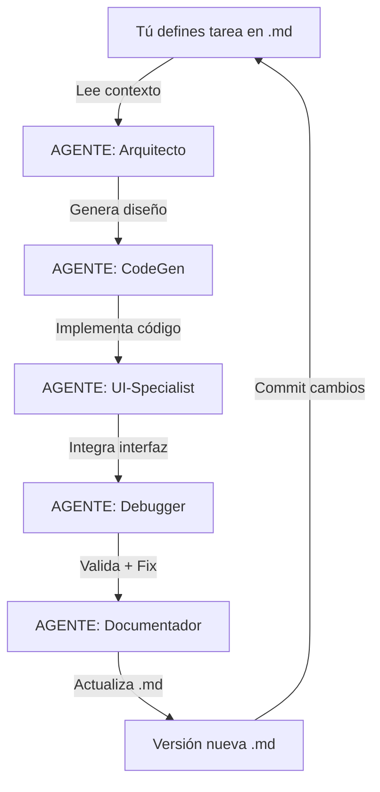

# 🎯 PROYECTO ACTACLARA - DOCUMENTO MAESTRO

**Versión:** 1.0  
**Fecha inicio:** 12 de marzo de 2026  
**Fecha defensa:** 30 de marzo de 2026  
**Días disponibles:** 18 días  
**Estado:** Fase de Desarrollo Acelerado

---

## 📋 ÍNDICE DE DOCUMENTACIÓN

Este es el documento central que orquesta todo el proyecto. A continuación, la estructura de documentos `.md` que guiarán el desarrollo:

```
ActaClara/
├── 00_PROJECT_MASTER_ACTACLARA.md          ← ESTE ARCHIVO (leer primero)
├── 01_SETUP_ENVIRONMENT.md                  ← Configuración del entorno
├── 02_DICCIONARIO_MODISMOS.md              ← Creación del diccionario
├── 03_P0_ARQUITECTURA_BASE.md              ← Prototipo 0 (Días 1-2)
├── 04_P1_MOTOR_TRANSCRIPCION.md            ← Prototipo 1 (Días 3-7)
├── 05_P2_NORMALIZACION_MODISMOS.md         ← Prototipo 2 (Días 8-11)
├── 06_P3_INTERFAZ_TKINTER.md               ← Prototipo 3 (Días 12-15)
├── 07_P4_EXPORTACION_DOCX.md               ← Prototipo 4 (Días 16-18)
├── 08_PROMPTS_GEMINI_CLI.md                ← Prompts para cada agente IA
├── 09_TROUBLESHOOTING_v1.0.md              ← Solución de errores comunes
├── 10_FASTER_WHISPER_LIMITACIONES.md       ← Análisis técnico faster-whisper
└── 11_DEMO_DEFENSA_SCRIPT.md               ← Guión para presentación 30/03
```

---

## 🎯 OBJETIVO DEL PROYECTO

**Sistema de transcripción de reuniones con normalización de modismos chilenos**

### MVP Mínimo para Defensa (30 marzo):
✅ Transcribir audio WAV/MP3 a texto  
✅ Detectar y normalizar modismos chilenos  
✅ Interfaz gráfica Tkinter funcional  
✅ Exportar acta en DOCX  
✅ Demo funcionando de 5 minutos  

### Fuera de Alcance (Post-Defensa):
❌ Exportación PDF  
❌ Repositorio SQLite completo  
❌ Empaquetado PyInstaller  
❌ Soporte multilenguaje (solo español CL)  

---

## 🏗️ ARQUITECTURA DEL SISTEMA

### Stack Tecnológico Confirmado

```
┌─────────────────────────────────────────────────────────┐
│                   ACTACLARA v1.0                        │
├─────────────────────────────────────────────────────────┤
│                                                         │
│  ┌──────────────┐    ┌──────────────┐    ┌─────────┐  │
│  │   Tkinter    │────│ Controlador  │────│ SQLite  │  │
│  │   UI Layer   │    │   Principal  │    │ (Local) │  │
│  └──────────────┘    └──────────────┘    └─────────┘  │
│         │                    │                         │
│         │                    │                         │
│  ┌──────▼────────┐    ┌──────▼──────────┐             │
│  │ Faster-Whisper│    │  Normalizador   │             │
│  │  (STT Local)  │    │   Modismos      │             │
│  └───────────────┘    └─────────────────┘             │
│         │                    │                         │
│         │                    │                         │
│  ┌──────▼────────┐    ┌──────▼──────────┐             │
│  │   FFmpeg/     │    │  python-docx    │             │
│  │    pydub      │    │  (Exportador)   │             │
│  └───────────────┘    └─────────────────┘             │
│                                                         │
└─────────────────────────────────────────────────────────┘

Lenguaje: Python 3.10+
OS Target: Windows 10/11 (primario), macOS/Linux (secundario)
```

### Componentes Principales

| Componente | Tecnología | Función | Estado |
|------------|------------|---------|--------|
| **UI** | Tkinter | Interfaz gráfica | ✅ Incluido en Python |
| **STT** | faster-whisper | Transcripción local | ⚠️ Requiere instalación |
| **Audio** | FFmpeg + pydub | Preprocesamiento | ⚠️ FFmpeg externo |
| **Normalización** | Regex + JSON | Detección modismos | 🔧 Desarrollar |
| **Exportación** | python-docx | Generar DOCX | ✅ Via pip |
| **Base de Datos** | SQLite | Almacenamiento local | ✅ Incluido en Python |

---

## 📊 BASE DE DATOS - DECISIÓN TÉCNICA

**DECISIÓN: SQLite Local (No Cloud)**

### Justificación:
```
✅ VENTAJAS:
- Cero configuración (incluido en Python)
- Sin dependencias de red
- Portátil (archivo .db único)
- Suficiente para MVP (< 1000 actas)
- Privacidad total (offline-first)

❌ DESVENTAJAS:
- No escalable a múltiples usuarios concurrentes
- Sin sincronización cloud
- Backup manual

📊 CONCLUSIÓN: Perfecto para demo de defensa
```

### Esquema SQLite Mínimo (v1.0)

```sql
-- Archivo: actaclara.db

CREATE TABLE actas (
    id INTEGER PRIMARY KEY AUTOINCREMENT,
    titulo TEXT NOT NULL,
    fecha_creacion DATETIME DEFAULT CURRENT_TIMESTAMP,
    idioma TEXT DEFAULT 'es-CL',
    duracion_segundos INTEGER,
    archivo_audio_ruta TEXT,
    archivo_docx_ruta TEXT,
    wer_medido REAL,
    version_diccionario TEXT DEFAULT '1.0'
);

CREATE TABLE modismos_detectados (
    id INTEGER PRIMARY KEY AUTOINCREMENT,
    acta_id INTEGER,
    expresion_original TEXT,
    expresion_normalizada TEXT,
    posicion_inicio INTEGER,
    posicion_fin INTEGER,
    accion_usuario TEXT CHECK(accion_usuario IN ('ACEPTADA', 'RECHAZADA', 'EDITADA')),
    FOREIGN KEY (acta_id) REFERENCES actas(id)
);

CREATE INDEX idx_acta_fecha ON actas(fecha_creacion);
CREATE INDEX idx_modismo_acta ON modismos_detectados(acta_id);
```

**Ubicación:** `data/actaclara.db` (creado automáticamente en primer uso)

---

## 🗓️ CRONOGRAMA AJUSTADO (18 DÍAS)

### FASE 1: PREPARACIÓN (12-13 marzo) - 2 DÍAS
```
Día 1 (12 marzo):
└─ Configurar entorno Python 3.10+
└─ Instalar dependencias (requirements.txt)
└─ Crear estructura de carpetas
└─ Configurar Gemini CLI

Día 2 (13 marzo):
└─ Crear diccionario inicial 50 modismos CL
└─ Grabar 3 audios de prueba (5-10 min c/u)
└─ Validar faster-whisper con audio test
```

### FASE 2: P0 - ARQUITECTURA (14 marzo) - 1 DÍA
```
└─ Definir clases principales (según documento)
└─ Crear esquema SQLite
└─ Implementar logging básico
└─ Validar: imports funcionan, DB se crea
```

### FASE 3: P1 - STT ENGINE (15-17 marzo) - 3 DÍAS
```
Día 15:
└─ Implementar ControladorAudio (lectura WAV/MP3)
└─ Integrar faster-whisper básico

Día 16:
└─ Crear CLI: python transcribe.py audio.wav
└─ Medir WER con 3 audios de prueba

Día 17:
└─ Optimizar parámetros Whisper
└─ Guardar transcripciones en SQLite
```

### FASE 4: P2 - NORMALIZACIÓN (18-20 marzo) - 3 DÍAS
```
Día 18:
└─ Implementar NormalizadorModismos
└─ Cargar diccionario JSON

Día 19:
└─ Detectar modismos con regex
└─ Marcar posiciones en texto

Día 20:
└─ Testing: 10 frases con modismos
└─ Validar precisión >80%
```

### FASE 5: P3 - UI TKINTER (21-24 marzo) - 4 DÍAS
```
Día 21:
└─ Crear ventana principal
└─ Botón "Importar Audio"
└─ Área de texto para transcripción

Día 22:
└─ Resaltado de modismos (colores)
└─ Tooltip con sugerencia

Día 23:
└─ Botones: Aceptar/Rechazar/Editar modismo
└─ Barra de progreso transcripción

Día 24:
└─ Integrar todo el flujo
└─ Testing completo UI
```

### FASE 6: P4 - EXPORTACIÓN (25-26 marzo) - 2 DÍAS
```
Día 25:
└─ Implementar GeneradorDocumentos
└─ Plantilla DOCX básica (python-docx)

Día 26:
└─ Botón "Exportar DOCX" en UI
└─ Guardar ruta en SQLite
└─ Testing: generar 3 actas
```

### FASE 7: DEMO Y DEFENSA (27-30 marzo) - 4 DÍAS
```
Día 27-28:
└─ Refinamiento visual mínimo
└─ Preparar PPT presentación
└─ Grabar video demo 5 min

Día 29:
└─ Ensayar defensa (3 veces)
└─ Preparar respuestas a preguntas

Día 30:
└─ DEFENSA 14:30 hrs 🎓
```

---

## 🤖 ESTRATEGIA MULTI-AGENTE IA

### Configuración: Google Antigravity + Open Agent Manager

**Agentes Recomendados:**

```
┌─────────────────────────────────────────────────────────┐
│  AGENTE 1: "Arquitecto"                                 │
│  ├─ Modelo: Gemini 3.1 pro (High)                       │
│  ├─ Rol: Diseño de clases, estructura de código        │
│  └─ Prompt: Ver 08_PROMPTS_GEMINI_CLI.md #Arquitecto   │
├─────────────────────────────────────────────────────────┤
│  AGENTE 2: "CodeGen-Backend"                            │
│  ├─ Modelo: Gemini 3 Flash                              │
│  ├─ Rol: Implementación Python (STT, Normalización)    │
│  └─ Prompt: Ver 08_PROMPTS_GEMINI_CLI.md #Backend      │
├─────────────────────────────────────────────────────────┤
│  AGENTE 3: "UI-Specialist"                              │
│  ├─ Modelo: Claude Sonnet 4.6 (Thinkings)               │
│  ├─ Rol: Código Tkinter, eventos, layouts              │
│  └─ Prompt: Ver 08_PROMPTS_GEMINI_CLI.md #UI           │
├─────────────────────────────────────────────────────────┤
│  AGENTE 4: "Debugger"                                   │
│  ├─ Modelo: GPT-OSS 120B (medium)                       │
│  ├─ Rol: Análisis de errores, fixes                    │
│  └─ Prompt: Ver 08_PROMPTS_GEMINI_CLI.md #Debug        │
├─────────────────────────────────────────────────────────┤
│  AGENTE 5: "Orquestador" (TÚ, Claude)                   │
│  ├─ Modelo: Claude Opus 4.6 (Thinkings)                 │
│  ├─ Rol: Generar/actualizar .md, orquestar             │
│  └─ Prompt: Orquestación de agentes                    │
└─────────────────────────────────────────────────────────┘
```

### Flujo de Trabajo Multi-Agente



---

## 📁 ESTRUCTURA DE CARPETAS

```
ActaClara/
├── docs/                              ← Documentos .md (este repo)
│   ├── 00_PROJECT_MASTER_ACTACLARA.md
│   ├── 01_SETUP_ENVIRONMENT.md
│   ├── 02_DICCIONARIO_MODISMOS.md
│   ├── ... (resto de .md)
│   └── versions/                      ← Histórico de cambios
│       ├── v1.0_12mar2026/
│       ├── v1.1_15mar2026/
│       └── ...
│
├── src/                               ← Código fuente
│   ├── main.py                        ← Punto de entrada
│   ├── config.py                      ← Configuración global
│   │
│   ├── controllers/
│   │   ├── __init__.py
│   │   ├── audio_controller.py
│   │   └── main_controller.py
│   │
│   ├── models/
│   │   ├── __init__.py
│   │   ├── transcription.py
│   │   ├── modismo.py
│   │   └── acta.py
│   │
│   ├── services/
│   │   ├── __init__.py
│   │   ├── stt_engine.py             ← faster-whisper
│   │   ├── normalizer.py              ← Detección modismos
│   │   └── exporter.py                ← DOCX generator
│   │
│   ├── ui/
│   │   ├── __init__.py
│   │   ├── main_window.py
│   │   ├── transcription_view.py
│   │   └── export_view.py
│   │
│   ├── utils/
│   │   ├── __init__.py
│   │   ├── logger.py
│   │   └── file_utils.py
│   │
│   └── database/
│       ├── __init__.py
│       ├── db_manager.py
│       └── schema.sql
│
├── data/                              ← Datos del proyecto
│   ├── actaclara.db                   ← SQLite database
│   ├── diccionarios/
│   │   ├── modismos_es_CL_v1.0.json
│   │   └── modismos_en_US_v1.0.json   ← Inglés (opcional)
│   ├── audios_prueba/
│   │   ├── test_01_limpio.wav
│   │   ├── test_02_ruido.wav
│   │   └── test_03_modismos.wav
│   └── actas_exportadas/              ← DOCX generados
│
├── tests/                             ← Testing básico
│   ├── test_normalizer.py
│   └── test_stt.py
│
├── logs/                              ← Logs de ejecución
│   └── actaclara_YYYYMMDD.log
│
├── requirements.txt                   ← Dependencias pip
├── .env.example                       ← Variables de entorno
├── .gitignore
└── README.md
```

---

## 🔧 DEPENDENCIAS (requirements.txt)

```txt
# Versión: 1.0
# Fecha: 12 marzo 2026
# Python: 3.10+

# STT Engine
faster-whisper==1.0.0
torch==2.1.0
torchaudio==2.1.0

# Audio Processing
pydub==0.25.1
# Nota: FFmpeg se instala por separado (ver 01_SETUP_ENVIRONMENT.md)

# Exportación
python-docx==1.1.0

# Base de datos (SQLite incluido en Python, pero por si acaso)
# No requiere instalación adicional

# UI (Tkinter incluido en Python estándar)
# No requiere instalación adicional

# Utilidades
python-dotenv==1.0.0
```

---

## 🎯 MÉTRICAS DE ÉXITO (KPIs)

### Para la Defensa del 30 de Marzo:

| Métrica | Objetivo | Método de Validación |
|---------|----------|---------------------|
| **WER (Word Error Rate)** | < 15% | Medir con 3 audios de prueba |
| **Precisión Modismos** | > 80% | 10 frases con modismos conocidos |
| **Tiempo Transcripción** | < 2x duración audio | Medir con audio de 5 min |
| **UI Usable** | Usuario completa flujo en < 5 min | Test con 1 persona |
| **Exportación DOCX** | 100% éxito | Generar 3 actas sin errores |

### Ejemplo de Log de Validación:

```python
# Archivo: tests/validation_results.json
{
    "fecha_validacion": "2026-03-26",
    "version": "1.0",
    "resultados": {
        "wer": {
            "audio_test_01": 12.3,
            "audio_test_02": 14.8,
            "audio_test_03": 13.1,
            "promedio": 13.4,
            "objetivo": 15.0,
            "cumple": true
        },
        "modismos": {
            "detectados": 8,
            "total": 10,
            "precision": 80.0,
            "objetivo": 80.0,
            "cumple": true
        }
    }
}
```

---

## 🚨 RIESGOS Y MITIGACIÓN

### Riesgo 1: faster-whisper no funciona en tu PC
**Probabilidad:** Media  
**Impacto:** CRÍTICO  
**Mitigación:**  
```
Plan A: Usar CPU (más lento pero funciona siempre)
Plan B: Reducir modelo (tiny/base en lugar de medium)
Plan C: Usar Whisper original (más lento, 100% compatible)
```

### Riesgo 2: Detección de modismos < 80%
**Probabilidad:** Media  
**Impacto:** Moderado  
**Mitigación:**  
```
- Ampliar diccionario a 100 expresiones
- Mejorar regex patterns
- Aceptar 70% si se justifica técnicamente
```

### Riesgo 3: No completar P3 (UI) a tiempo
**Probabilidad:** Baja  
**Impacto:** Alto  
**Mitigación:**  
```
- Priorizar CLI funcional (P1+P2)
- UI mínima: 1 ventana, 3 botones
- Demo por consola como backup
```

---

## 📚 PRÓXIMOS PASOS INMEDIATOS

### HOY (12 marzo):
1. ✅ Leer este documento completo
2. 📖 Leer `01_SETUP_ENVIRONMENT.md`
3. 🔧 Ejecutar instalación de dependencias
4. ✅ Validar que Python 3.10+ está instalado
5. 📝 Crear carpeta `ActaClara/` con estructura

### MAÑANA (13 marzo):
1. 📖 Leer `02_DICCIONARIO_MODISMOS.md`
2. ✍️ Crear primer diccionario (50 modismos)
3. 🎤 Grabar 3 audios de prueba
4. 🧪 Test rápido de faster-whisper

### SIGUIENTE (14 marzo):
1. 📖 Leer `03_P0_ARQUITECTURA_BASE.md`
2. 🏗️ Implementar clases base
3. 🗄️ Crear esquema SQLite
4. ✅ Validar P0 completo

---

## 🆘 ¿QUÉ HACER SI...?

### ...fast-whisper da error al instalar?
👉 Ver `09_TROUBLESHOOTING_v1.0.md` → Sección "Instalación faster-whisper"

### ...no sé cómo usar Gemini CLI?
👉 Ver `08_PROMPTS_GEMINI_CLI.md` → Sección "Comandos básicos"

### ...un agente IA genera código que no funciona?
👉 Ver `08_PROMPTS_GEMINI_CLI.md` → Sección "Prompt de Debug"

### ...me atrasé en el cronograma?
👉 Contactar al orquestador (Claude) para ajustar plan

---

## 📞 CONTACTO Y SOPORTE

**Orquestador del Proyecto:** Claude (este agente)  
**Desarrollador:** Ian Leonardo Castro Contreras  
**Fecha Defensa:** 30 marzo 2026, 14:30 hrs  
**Email:** ian.oficio@gmail.com

---

## ✅ CHECKLIST ANTES DE CONTINUAR

Marca con `[x]` cuando completes:

- [ ] He leído este documento completo
- [ ] Entiendo la arquitectura del sistema
- [ ] Confirmo que tengo 18 días (12-30 marzo)
- [ ] Estoy de acuerdo con priorizar P0-P4
- [ ] Tengo Python 3.10+ instalado
- [ ] Estoy listo para leer `01_SETUP_ENVIRONMENT.md`

---

**IMPORTANTE:** Este documento es VIVO. Se actualizará con cada cambio significativo.

**Versión actual:** v1.0 - 12 marzo 2026  
**Próxima revisión:** v1.1 - 14 marzo 2026 (post P0)

---

🚀 **¡Comencemos! Siguiente paso: Leer `01_SETUP_ENVIRONMENT.md`**
